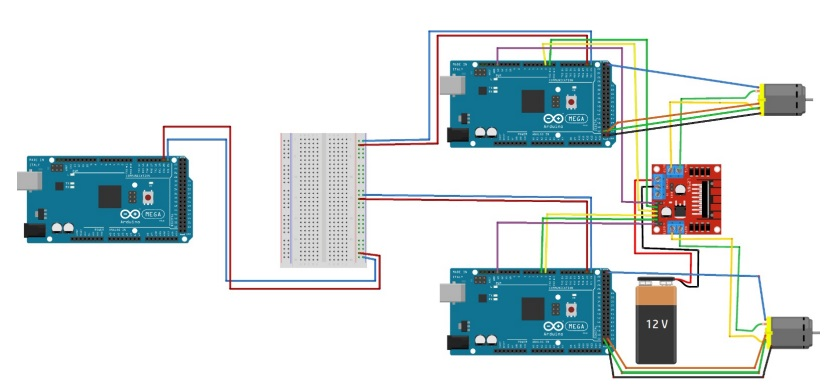
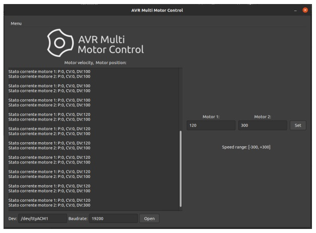

# Multi-Motor Control

This project focuses on controlling multiple DC motors using PID controllers implemented on AVR microcontrollers. The communication between the controllers is managed through the I2C protocol. The project is divided into two main parts:

1. **PID Controller Implementation** by Georgi Dimitrov.
2. **I2C Communication Protocol Implementation** by Sara Attiani.

## Project Overview

The system is designed to control multiple DC motors simultaneously using a distributed architecture. Each motor is controlled by an AVR microcontroller, which communicates with a central master controller vi

### Features

- **Distributed Control**: Each motor is controlled by a separate AVR microcontroller.
- **I2C Communication**: The microcontrollers communicate using the I2C protocol, allowing for a simple two-wire connection.
- **PID Control**: Each motor is controlled using a PID controller, which adjusts the motor speed based on feedback from an encoder.
- **Graphical User Interface**: A GTK-based interface allows users to control the motors and monitor their status.

## Repository Structure

- **/src**: Contains the source code for the AVR microcontrollers, including the PID controller and I2C communication protocol.
- **/docs**: Documentation, including the thesis and project reports.
- **/schematics**: Circuit diagrams and schematics for the hardware setup.
- **/gui**: Source code for the GTK-based graphical user interface.

## Circuit Schematic

Below is the schematic diagram of the multi-motor control system:

## Graphical User Interface

The GTK-based interface allows users to control the motors and monitor their status in real-time. Below is a screenshot of the interface:

# 

## Prerequisites

- **AVR Toolchain**: Ensure you have the AVR toolchain installed on your system.
- **GTK Development Libraries**: Required for building the graphical user interface.
- **AVR Microcontrollers**: ATmega2560 or compatible microcontrollers.
- **Motors and Encoders**: DC motors with encoders for feedback.
  
  

## Contributing

Contributions are welcome! Please fork the repository and submit a pull request with your changes.

## Authors

- **Georgi Dimitrov** - PID Controller Implementation

- **Sara Attiani** - I2C Communication Protocol Implementation

## Acknowledgments

- **Prof. Giorgio Grisetti** for guidance and support.

- **Sapienza University of Rome** for providing the resources and environment to develop this project.
